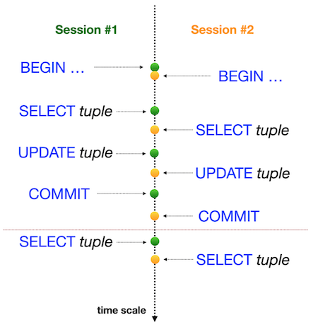
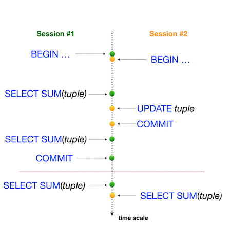

# Day 08 - Piscine SQL

## _Isolation is one of ACID properties_

## Contents

1. [Chapter I](#chapter-i) \
    1.1. [Exercise 00 - Simple transaction](#exercise-00-simple-transaction)  
2. [Chapter II](#chapter-ii) \
    2.1. [Exercise 01 - Lost Update Anomaly](#exercise-01-lost-update-anomaly)  
3. [Chapter III](#chapter-iii) \
    3.1. [Exercise 02 - Lost Update for Repeatable Read](#exercise-02-lost-update-for-repeatable-read)  
4. [Chapter IV](#chapter-iv) \
    4.1. [Exercise 03 - Non-Repeatable Reads Anomaly](#exercise-03-non-repeatable-reads-anomaly)  
5. [Chapter V](#chapter-v) \
    5.1. [Exercise 04 - Non-Repeatable Reads for Serialization](#exercise-04-non-repeatable-reads-for-serialization)
6. [Chapter VI](#chapter-vi) \
    6.1. [Exercise 05 - Phantom Reads Anomaly](#exercise-05-phantom-reads-anomaly)
7. [Chapter VII](#chapter-vii) \
    7.1. [Exercise 06 - Phantom Reads for Repeatable Read](#exercise-06-phantom-reads-for-repeatable-read)
8. [Chapter VIII](#chapter-viii) \
    8.1. [Exercise 07 - Deadlock](#exercise-07-deadlock)

## Chapter I
## Exercise 00 - Simple transaction

| Exercise 00: Simple transaction |                                                                                                                          |
|---------------------------------------|--------------------------------------------------------------------------------------------------------------------------|
| Turn-in directory                     | 00                                                                                                                     |
| **Allowed**                               |                                                                                                                          |
| Language                        |  SQL|

Please for this task use the command line for PostgreSQL database (psql). You need to check how your changes will be published in the database for other database users. 

Actually, we need two active sessions (meaning 2 parallel sessions in the command lines). 

Please provide a proof that your parallel session can’t see your changes until you will make a `COMMIT`;

Take a look at the steps below.

**Session #1**
- update of rating for “Pizza Hut” to 5 points in a transaction mode .
- check that you can see a changes in session #1

**Session #2**
- check that you can’t see a changes in session #2

**Session #1**
- publish your changes for all parallel sessions.

**Session #2**
- check that you can see a changes in session #2

So, take a look on example of my output for Session #2.

    pizza_db=> select * from pizzeria where name  = 'Pizza Hut';
    id |   name    | rating
    ----+-----------+--------
    1 | Pizza Hut |    4.6
    (1 row)

    pizza_db=> select * from pizzeria where name  = 'Pizza Hut';
    id |   name    | rating
    ----+-----------+--------
    1 | Pizza Hut |      5
    (1 row)

You can see the same query returns different results, because the first one was run before publishing in Session#1 and the second one was queried after finished Session#1. 

## Chapter II
## Exercise 01 - Lost Update Anomaly

| Exercise 01: Lost Update Anomaly|                                                                                                                          |
|---------------------------------------|--------------------------------------------------------------------------------------------------------------------------|
| Turn-in directory                     | 01                                                                                                                     |                                                                               |
| **Allowed**                               |                                                                                                                          |
| Language                        |  SQL                                                                                              |

Please for this task use the command line for PostgreSQL database (psql). You need to check how your changes will be published in the database for other database users. 

Actually, we need two active sessions (meaning 2 parallel sessions in the command lines). 

Before a task, make sure you are at a default isolation level in your database. Just run the next statement

`SHOW TRANSACTION ISOLATION LEVEL;`

and the result should be “read committed”;

If not, then please set “read committed” isolation level explicitly on a session level.

|  |  |
| ------ | ------ |
| Let’s check one of the famous “Lost Update Anomaly” database pattern. You can see a graphical presentation of that anomaly on a picture. Horizontal Red Line means the final results after all sequential steps for both Sessions. |  |

Please check a rating for “Pizza Hut” in a transaction mode for both Sessions and after that make `UPDATE` of rating to 4 value in session #1 and make `UPDATE` of rating to 3.6 value in session #2 (in the same order as in the picture). 

## Chapter III
## Exercise 02 - Lost Update for Repeatable Read

| Exercise 02: Lost Update for Repeatable Read|                                                                                                                          |
|---------------------------------------|--------------------------------------------------------------------------------------------------------------------------|
| Turn-in directory                     | 02                                                                                                                     |                                                                             |
| **Allowed**                               |                                                                                                                          |
| Language                        |  SQL                                                                                              |

Please for this task use the command line for PostgreSQL database (psql). You need to check how your changes will be published in the database for other database users. 

Actually, we need two active sessions (meaning 2 parallel sessions in the command lines).

|  |  |
| ------ | ------ |
| Let’s check one of the famous “Lost Update Anomaly” database pattern but under `REPEATABLE READ` isolation level. You can see a graphical presentation of that anomaly on a picture. Horizontal Red Line means the final results after all sequential steps for both Sessions. |  |

Please check a rating for “Pizza Hut” in a transaction mode for both Sessions and after that make `UPDATE` of rating to 4 value in session #1 and make `UPDATE` of rating to 3.6 value in session #2 (in the same order as in the picture). 

## Chapter IV
## Exercise 03 - Non-Repeatable Reads Anomaly

| Exercise 03: Non-Repeatable Reads Anomaly |                                                                                                                          |
|---------------------------------------|--------------------------------------------------------------------------------------------------------------------------|
| Turn-in directory                     | 03                                                                                                                     |                                                                              |
| **Allowed**                               |                                                                                                                          |
| Language                        |  SQL                                                                                              |

Please for this task use the command line for PostgreSQL database (psql). You need to check how your changes will be published in the database for other database users. 

Actually, we need two active sessions (meaning 2 parallel sessions in the command lines). 

|  |  |
| ------ | ------ |
| Let’s check one of the famous “Non-Repeatable Reads” database pattern but under `READ COMMITTED` isolation level. You can see a graphical presentation of that anomaly on a picture. Horizontal Red Line means the final results after all sequential steps for both Sessions. |  |

Please check a rating for “Pizza Hut” in a transaction mode for both Sessions and after that make `UPDATE` of rating to 3.6 value in session #2 (in the same order as in the picture). 

## Chapter V
## Exercise 04 - Non-Repeatable Reads for Serialization

| Exercise 04: Non-Repeatable Reads for Serialization |                                                                                                                          |
|---------------------------------------|--------------------------------------------------------------------------------------------------------------------------|
| Turn-in directory                     | 04                                                                                                                     |                                                                               |
| **Allowed**                               |                                                                                                                          |
| Language                        |  SQL                                                                                              |

Please for this task use the command line for PostgreSQL database (psql). You need to check how your changes will be published in the database for other database users. 

Actually, we need two active sessions (meaning 2 parallel sessions in the command lines).

|  |  |
| ------ | ------ |
| Let’s check one of the famous “Non-Repeatable Reads” database pattern but under `SERIALIZABLE` isolation level. You can see a graphical presentation of that anomaly on a picture. Horizontal Red Line means the final results after all sequential steps for both Sessions. |  |

Please check a rating for “Pizza Hut” in a transaction mode for both Sessions and after that make `UPDATE` of rating to 3.0 value in session #2 (in the same order as in the picture). 

## Chapter VI
## Exercise 05 - Phantom Reads Anomaly

| Exercise 05: Phantom Reads Anomaly|                                                                                                                          |
|---------------------------------------|--------------------------------------------------------------------------------------------------------------------------|
| Turn-in directory                     | 05                                                                                                                                                                                                   |
| **Allowed**                               |                                                                                                                          |
| Language                        |   SQL                                                                                              |

Please for this task use the command line for PostgreSQL database (psql). You need to check how your changes will be published in the database for other database users. 

Actually, we need two active sessions (meaning 2 parallel sessions in the command lines).

|  |  |
| ------ | ------ |
| Let’s check one of the famous “Phantom Reads” database pattern but under `READ COMMITTED` isolation level. You can see a graphical presentation of that anomaly on a picture. Horizontal Red Line means the final results after all sequential steps for both Sessions. |  |

Please summarize all ratings for all pizzerias in a transaction mode for both Sessions and after that make `UPDATE` of rating to 1 value for “Pizza Hut” restaurant in session #2 (in the same order as in the picture). 

 

## Chapter VII
## Exercise 06 - Phantom Reads for Repeatable Read

| Exercise 06: Phantom Reads for Repeatable Read|                                                                                                                          |
|---------------------------------------|--------------------------------------------------------------------------------------------------------------------------|
| Turn-in directory                     | 06                                                                                                                     |                                                                               |
| **Allowed**                               |                                                                                                                          |
| Language                        |  SQL                                                                                              |

Please for this task use the command line for PostgreSQL database (psql). You need to check how your changes will be published in the database for other database users. 

Actually, we need two active sessions (meaning 2 parallel sessions in the command lines).

|  |  |
| ------ | ------ |
| Let’s check one of the famous “Phantom Reads” database pattern but under `REPEATABLE READ` isolation level. You can see a graphical presentation of that anomaly on a picture. Horizontal Red Line means the final results after all sequential steps for both Sessions. |  |

Please summarize all ratings for all pizzerias in a transaction mode for both Sessions and after that make `UPDATE` of rating to 5 value for “Pizza Hut” restaurant in session #2 (in the same order as in the picture). 

## Chapter VIII
## Exercise 07 - Deadlock

| Exercise 07: Deadlock|                                                                                                                          |
|---------------------------------------|--------------------------------------------------------------------------------------------------------------------------|
| Turn-in directory                     | 07                                                                                                                     |                                                                               |
| **Allowed**                               |                                                                                                                          |
| Language                        |  SQL                                                                                              |

Please for this task use the command line for PostgreSQL database (psql). You need to check how your changes will be published in the database for other database users. 

Actually, we need two active sessions (meaning 2 parallel sessions in the command lines). 

Let’s reproduce a deadlock situation in our database. 

|  |  |
| ------ | ------ |
| You can see a graphical presentation of the deadlock situation on a picture. Looks like a “christ-lock” between parallel sessions. |  |

Please write any SQL statement with any isolation level (you can use default setting) on the `pizzeria` table to reproduce this deadlock situation.

