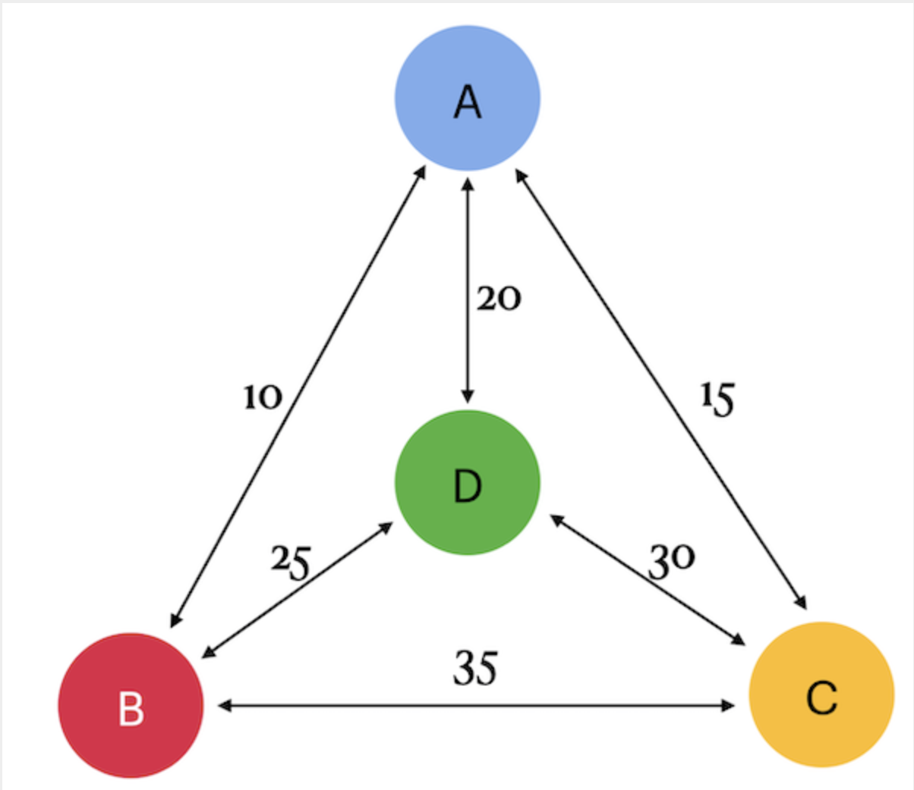

# Team 00 - Piscine SQL

## _Traveling Salesman Problem_

## Contents
 
1. [Chapter I](#chapter-i) \
    1.1. [Exercise 00 - Classical TSP](#exercise-00-classical-tsp)  
2. [Chapter II](#chapter-ii) \
    2.1. [Exercise 01 - Opposite TSP](#exercise-01-opposite-tsp)  

## Chapter I
## Exercise 00 - Classical TSP

| Exercise 00: Classical TSP|                                                                                                                          |
|---------------------------------------|--------------------------------------------------------------------------------------------------------------------------|
| Turn-in directory                     | 00                                                                                                                     |                                                                               |
| **Allowed**                               |                                                                                                                          |
| Language                        | ANSI SQL|
| SQL Syntax Pattern                        | Recursive Query|

Please take a look at the Graph on the left. 
There are 4 cities (a, b, c and d) and arcs between them with cost (or taxination). Actually the cost (a,b) = (b,a).

Please create a table with name nodes by using structure {point1, point2, cost} and fill data based on a picture (remember there are direct and reverse paths between 2 nodes).
Please write one SQL statement that returns all tours (aka paths) with minimal traveling cost if we will start from city "a".
Just remember, you need to find the cheapest way of visiting all the cities and returning to your starting point. For example, the tour looks like that a -> b -> c -> d -> a.

The sample of output data you can find below. Please sort data by total_cost and then by tour.

| total_cost | tour |
| ------ | ------ |
| 80 | {a,b,d,c,a} |
| ... | ... |

## Chapter II
## Exercise 01 - Opposite TSP

| Exercise 01: Opposite TSP|                                                                                                                          |
|---------------------------------------|--------------------------------------------------------------------------------------------------------------------------|
| Turn-in directory                     | 01                                                                                                                     |                                                                            |
| **Allowed**                               |                                                                                                                          |
| Language                        | ANSI SQL|
| SQL Syntax Pattern                        | Recursive Query|

Please add a possibility to see additional rows with the most expensive cost to the SQL from previous exercise. Just take a look at the sample of data below. Please sort data by total_cost and then by tour.

| total_cost | tour |
| ------ | ------ |
| 80 | {a,b,d,c,a} |
| ... | ... |
| 95 | {a,d,c,b,a} |
